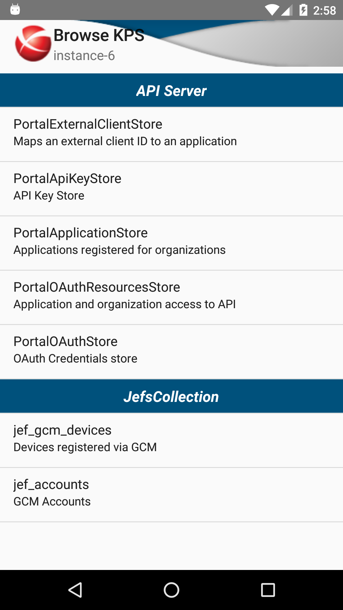

# APIGW Mobile
API Gateway for Android

### Features ###

* Connection Manager - to manage connections to your Admin Node Managers
* SSL Support - Internal keystore allows for easy SSL certificate trusting
* Console - if you have a Terminal Emulator app on your device, you can SSH to your host(s) and/or start Gateways with a menu selection (currently works only with the jackpal.androidterm package)
* Google Drive integration for KPS and Deployment backups

### Topology Management ###
* Add/Edit/Remove Groups and Gateway Instances
* Start/stop Gateway Instances
* Consistency check for instances within each group

### Key Property Stores (KPS) ###
* Browse KPS tables
* Add/Edit/Remove rows
* Backup to Google Drive account

### Active MQ Messaging ###
* Browse Queues, Topics, Consumers, Subscribers and Messages
* Add/Remove Queues and Topics

### Manage Deployments ###
* Modify Policy/Environment properties
* Backup Deployment/Policy/Environment archives to Google Drive account

### Dependencies ###
* API Gateway's common.jar and server.jar
* com.android.support:appcompat-v7:23.1.1
* com.squareup.okhttp3:okhttp:3.0.1
* com.squareup.okio:okio:1.6.0
* com.squareup:otto:1.3.8
* com.google.code.gson:gson:2.2.4
* com.jakewharton:butterknife:7.0.1
* com.android.support:cardview-v7:23.1.1
* com.android.support:support-v4:23.1.1
* com.google.android.gms:play-services-drive:8.4.0

### Android components used ###
The Connection Manager is backed by a ContentProvider implementation and SQLite database.

### Screenshots ###
&nbsp;
&nbsp;
&nbsp;
&nbsp;
&nbsp;
&nbsp;
&nbsp;
